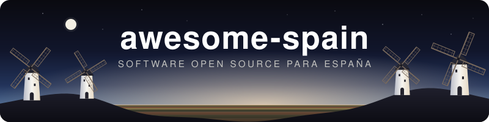

---
hide:
  - navigation
  - toc
---

# Awesome Spain { .as-visually-hidden }

  

  
  
  <a href="#contenido">-c60b1e?style=flat-square"></a>
  
  

---

**Awesome Spain** es una selección de <!-- n:proyectos --> proyectos open source, en <!-- n:categorias --> categorías, que dan soporte específico a España: sus administraciones, instituciones, servicios públicos y empresas cuyo mercado principal es España. Cada entrada enlaza al repositorio y al servicio o institución al que da soporte, y muestra sus estrellas, último commit, lenguaje y licencia. Se retiran los proyectos archivados, borrados, abandonados, sustituidos, fuera de criterio o que han dejado de funcionar; cada uno queda en [DELETED.md](https://github.com/GeiserX/awesome-spain/blob/main/DELETED.md) con su motivo (<!-- n:retirados --> hasta hoy).

-   :material-format-list-bulleted: **[Explorar por categoría](#contenido)**

    ---

    De Agricultura a Validación de Documentos, pasando por AEAT, DGT, Catastro, Renfe y Redsys. El índice lateral sigue la categoría que estás leyendo.

-   :material-magnify: **[Buscar un proyecto](https://geiserx.github.io/awesome-spain/?q=verifactu)**

    ---

    Pulsa `/` y escribe lo que necesitas: VeriFactu, TicketBAI, AutoFirma, norma43, PVPC. La búsqueda cubre el nombre y la descripción de todas las entradas.

-   :material-plus-box-outline: **[Proponer un proyecto](https://github.com/GeiserX/awesome-spain/issues/new?template=anadir-proyecto.md)**

    ---

    Abre un issue con la plantilla o envía un pull request siguiendo las [directrices](https://github.com/GeiserX/awesome-spain/blob/main/contributing.md). Solo hace falta el enlace, la descripción y el servicio español al que da soporte.

-   :material-shield-check-outline: **[Añade la insignia a tu proyecto](#insignia)**

    ---

    Si tu proyecto está en la lista, una insignia en tu README lo dice. Cuatro estilos, una línea de Markdown.

## Cómo se mantiene la lista

- Entra el software que da soporte a España, no el software hecho por alguien español. Los criterios completos están en [contributing.md](https://github.com/GeiserX/awesome-spain/blob/main/contributing.md).
- Un proyecto archivado se retira sin más. Uno que no lo está se retira cuando deja de funcionar, y hay que poder enseñar el fallo; la falta de commits recientes no lo retira. También salen los repos borrados o renombrados, los que su autor da por abandonados, los sustituidos por otro proyecto y los que no cumplen los criterios.
- Los proyectos retirados quedan en [DELETED.md](https://github.com/GeiserX/awesome-spain/blob/main/DELETED.md) con su motivo, para no volver a añadirlos por error.
- La integración continua comprueba el formato, el orden alfabético y las insignias en cada cambio ([awesome-lint-extra](https://github.com/GeiserX/awesome-lint-extra)). Cada mes se revisan los enlaces rotos que encuentra lychee y cada trimestre se buscan repos recién archivados. La guía de los mantenedores es [MAINTENANCE.md](https://github.com/GeiserX/awesome-spain/blob/main/MAINTENANCE.md).

--8<-- "README.md:lista"
